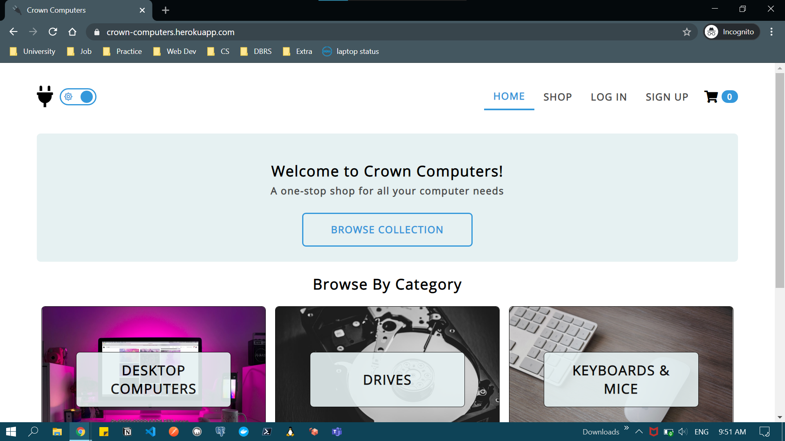
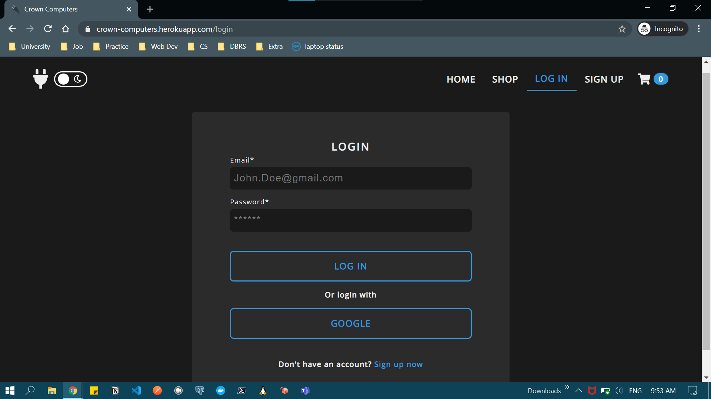
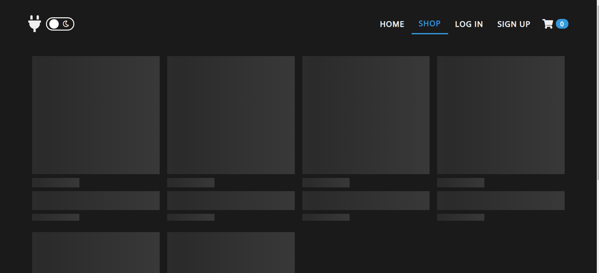
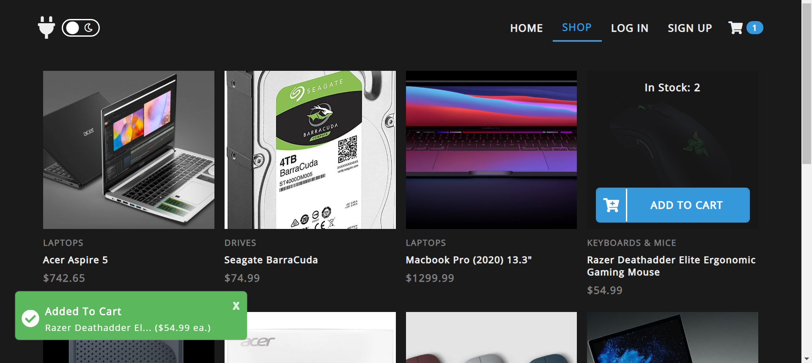
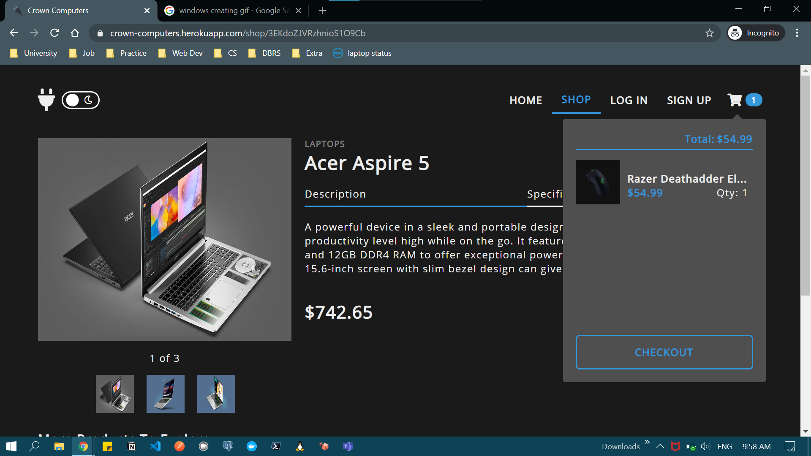
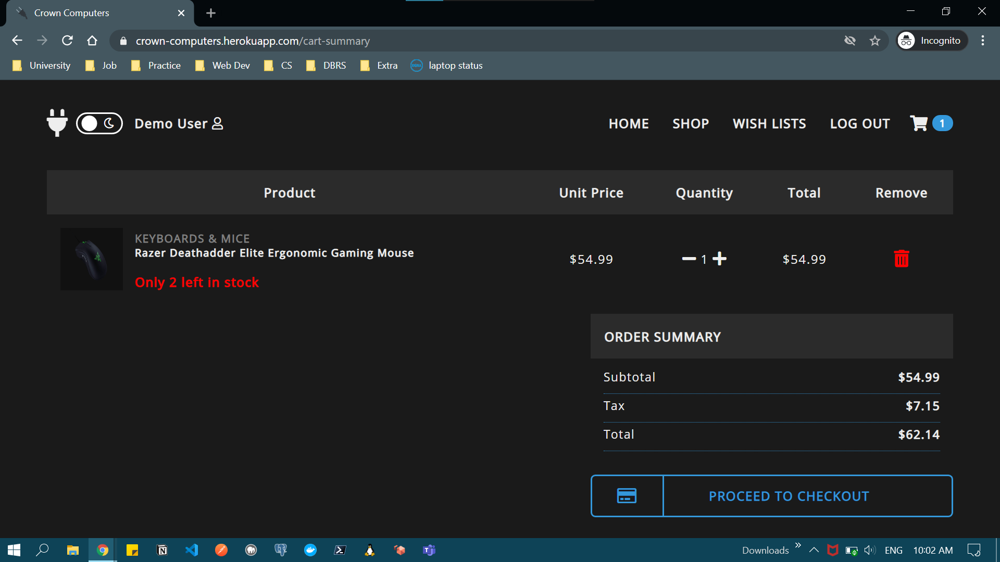
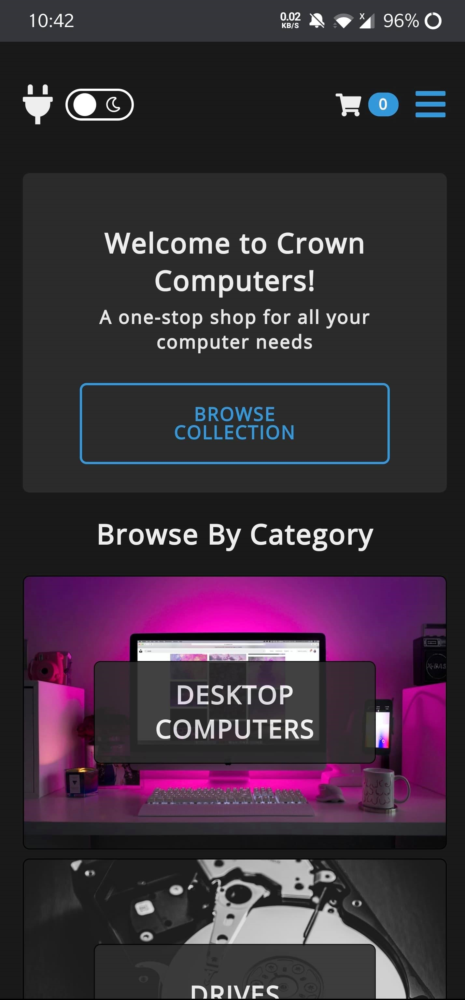
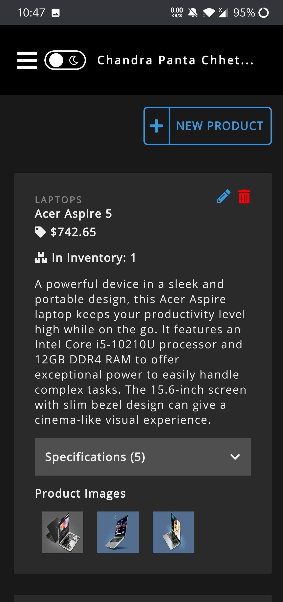
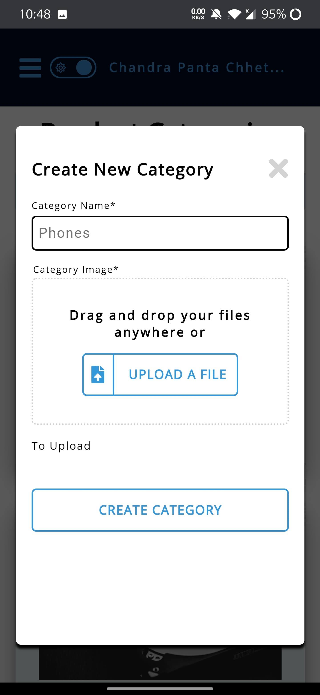
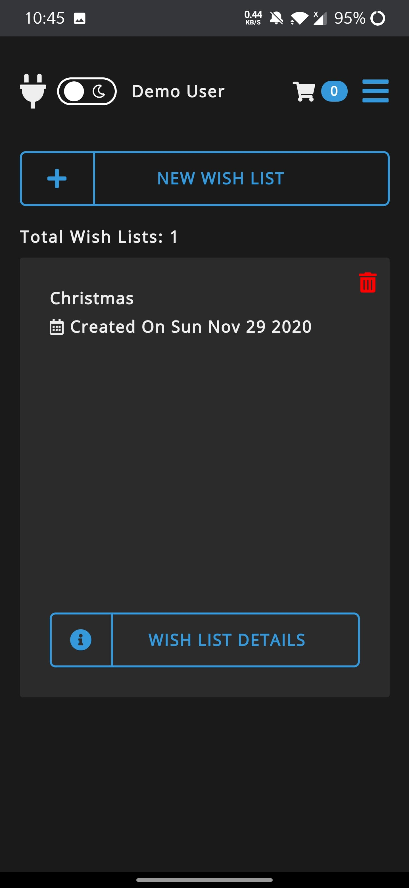

# Crown Computers

A responsive PWA E-commerce site that sells all things to do with computers. Customers can browse the product collection, add items to their cart, save items to wish list(s), checkout their cart. Admins can view sale history, add new products, update existing products, create new product categories, and more.
* [What app looks like](#what-app-looks-like)
* [Features](#features)
* [Dependencies](#dependencies)
* [Running locally](#running-locally)

## What app looks like

 
 
 
 
 
 

## Features

- Sign up & login using Google account or by creating a regular account (email & password)
- Auto Sign in
- Infinite scrolling
- Easy order payment via Stripe
- In-app toast messages
- Dark mode
- Reponsive site
- PWA (works offline, native app experience)
- Public users can
  - Browse products by category
  - Add/Remove products to/from cart
  - Checkout cart
  - View a product's specifications (e.g. amount of storage)
- Authenticated Users (Non-Admins) can
  - Do all the things public users can
  - Create wish lists
  - Add products to wish list(s) to checkout at a later time
  - Save their cart to their account
  - Restore their cart from their last session
- Admins can
  - View sales (customer info, number of items sold, total sales, products sold)
  - Create, update, delete products (e.g. upload new product images)
  - Create, update, delete product categories (e.g. Rename product category)

## Dependencies

- [Nodejs](https://nodejs.org/en/download/)
  - NPM should be installed after installing Node

Main NPM dependencies:

- express
- stripe
- react
- redux
- redux-saga
- reselect
- styled components
- firebase
- react-stripe-js

## Running locally

1. Fork or clone the repo.
2. Install NPM dependencies via `npm i && cd client && npm i`.
3. Ensure all dev dependencies are installed as well.
4. Checkout dev branch.
5. Rename both .env-cmdrc-example files (root & in client folder) to .env-cmdrc and add the env variables.
   
   To get env variable values:
     1. Create a [Firebase project](https://console.firebase.google.com/) and go into project settings to get:
         - REACT_APP_FIREBASE_API_KEY 
         - REACT_APP_FIREBASE_AUTH_DOMAIN
         - REACT_APP_FIREBASE_DATABASE_URL
         - REACT_APP_FIREBASE_PROJECT_ID
         - REACT_APP_FIREBASE_STORAGE_BUCKET
         - REACT_APP_FIREBASE_MESSAGING_SENDER_ID
         - REACT_APP_FIREBASE_MEASUREMENT_ID, REACT_APP_FIREBASE_APP_ID.
     2. Create a [Stripe account](https://dashboard.stripe.com/register) to get:
         - STRIPE_SECRET_KEY
         - REACT_APP_STRIPE_PUBLISHABLE_KEY
6. Run `npm run dev` in project root.
7. Frontend should be running on localhost:3000 and API on localhost:8000.

**Note: To deploy cloud functions in cloud_functions folder, run `npm i -g firebase-tools` to install firebase cli globally and run `firebase deploy --only functions`.**
